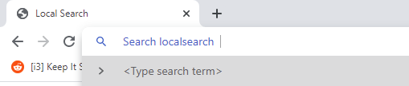

# localsearch
http://localsearch



⚠ Work in Progress ⚠

Localsearch is a a small search engine that runs on your machine, it allows support for browser aliases and provides predictive search suggestions from configured sources (Local files, Github, ...).

## Order of Precedence
1. Shell Aliases (`.bashrc`, `.zshrc`)/Path
2. Built In Commands

If the command is a shell alias or in path, start a terminal with the given command and arguments.

If the command is a built in command, localsearch runs it. Built-in commands can be overridden by creating an alias of the same name in your `.bashrc` or `.zshrc`. Also new commands can be added like that as well.

## Usage

Command | Example | Description
--- | --- | ---
help | help | Displays the friendly help page
i \<issue number> | i #123 | Opens issue \<issue>
w \<query> | w | Search wiki for \<query>
adr \<query> | adr Dependency Injection | Searches ADRs for \<query>
t, term | t | Opens the terminal
t, term \<command> | term echo hi | Opens the terminal and runs \<command>
g | g | Opens Grafana
gh \<name> | gh shifu | Opens Github and goes to the shifu repo. For non-mm repos, need to do `gh User/Repo`
cov \<name> | cov shifu | Opens coverage for 
conf \<name> | conf shifu | Opens configuration file for given project.

# Server Setup

Add localsearch to your `/etc/hosts` (Linux) or `C:\Windows\System32\drivers\etc\hosts` (Windows)

```
# Added by Localsearch
127.0.0.1       localsearch
127.0.0.1       www.localsearch
# End of section
```

Starting localsearch will start the localsearch server, that provides the search functionality along with suggestions.

# Browser Setup

## Firefox
Localsearch will serve a firefox extension at http://localsearch/firefox. You can download and install this now, or during the first time you visit http://localsearch click on the little green button in the search bar.

## Chrome
// TODO: Can't get suggestions when the search engine is added, but when it's using opensearch.xml it gets suggestions fine. Look into this.

1. Go to [chrome://settings/searchEngines](chrome://settings/searchEngines)
2. Add (Search Engine, Keyword, URL with %s in place of query) = (localsearch, l, localsearch?q=%s)
    - For development localsearch, the URL should include the development port (Default to `8080`) 
3. Try it out, type `l` in the omnibar and press tab. You should see *"Search localsearch"*, suggestions should be there too.

## Edge (the new chromium based one)

See Chrome instructions. But go to [edge://settings/searchEngines](edge://settings/searchEngines)
