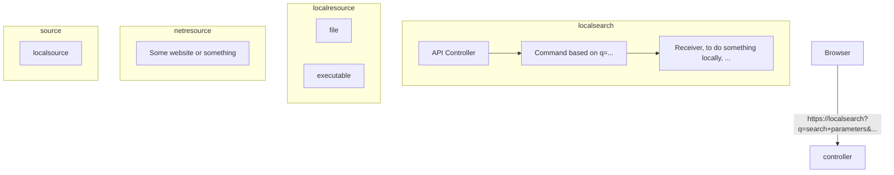

# Initial Design

Localsearch



*[Can't see the diagram? Click here to view in browser.](https://mermaid-js.github.io/mermaid-live-editor/)*


## Arch
- Follow the usual Matcha Meet stuff.
- Prefer `@Autowired` Constructor Injection, as usual.

## Design

Basically the command pattern.

API Controller
- Check if query parameter q=... is present
    - If not, return the HTML search page
- Tokenize q=...
    - command = q[0]
    - args = q[1:] (Nullable)
- Client: Browser
- Invoker: API Controller
- Command: Command Classes, execute() will call the appropriate receiver. Command will handle 
- Receiver: Underlying stuff here, doing something locally or do something with the request.
- Ensure that is a separation between command and receiver, for most commands it will be a trivial 1-1 thing. For other commands, like the terminal stuff, it may not.
- Don't really need to have a seperation between command and receiver.
    - Receiver will 

The handlers should be relatively simple and easy to add to.

### Handler interface

```
interface Handler {
    String handlerId;
    String command;
    String[] args;

    public execute(String command, String[] args)
}
```

## Test if command is alias/path.
- Run `where command`, which returns 0 iff in alias/path.

## Hosts File

Add the following to hosts file.
```hosts
localsearch    127.0.0.1
```

## Firefox Search Order

```
How to:

Add to the region.properties file the appropriate search order for your locale. The most common example, with Google first, is:

browser.search.defaultenginename = Google
browser.search.order.1 = Google
browser.search.order.2 = Yahoo

The code does not support specific order for more than two plugins.
```
[Source](https://wiki.mozilla.org/Firefox3/L10n_Requirements#Search_Order)

# Resources

# Spec
- https://superuser.com/questions/1034260/using-search-prediction-with-custom-search-engine-in-chrome
- https://github.com/dewitt/opensearch/blob/master/opensearch-1-1-draft-6.md
https://stackoverflow.com/questions/35237414/add-suggestion-url-for-custom-search-engine-in-chrome

## Misc
https://developer.mozilla.org/en-US/docs/Archive/Add-ons/Supporting_search_suggestions_in_search_plugins
https://superuser.com/questions/1399929/how-can-you-modify-url-predictions-on-chrome
https://www.chromium.org/tab-to-search

## UX
- https://www.nngroup.com/articles/site-search-suggestions/
    - There's a lot of stuff on the UX of this. Nielson good start.
- https://news.ycombinator.com/item?id=19438826

## Mozilla/Firefox

- https://wiki.mozilla.org/Labs/Ubiquity/Ubiquity_0.5_User_Tutorial
- https://wiki.mozilla.org/Labs/Ubiquity/Ubiquity_0.1_User_Tutorial#Starting_Ubiquity

# Browser Source Code
- https://searchfox.org/mozilla-central/source/toolkit/components/search/SearchSuggestionController.jsm
- https://searchfox.org/mozilla-central/source/toolkit/components/search/SearchSuggestions.jsm
- https://chromium.googlesource.com/chromium/src/+/master/chrome/browser/autocomplete

# Responses
- See https://wiki.mozilla.org/Firefox3/L10n_Requirements#Search_Order

## Google

GET http://suggestqueries.google.com/complete/search?output=firefox&client=firefox&qu={searchTerms}

```
["{searchTerms}",["search terms pokemon go","search terms google","search terms amazon","search terms meaning","search terms report","search terms examples","search terms google ads","search terms google scholar","search terms in google analytics","search terms for literature review"],[],{"google:suggestsubtypes":[[10],[10],[10],[10],[10],[10],[10],[10],[10],[10]]}]
```

## Yahoo

GET http://ff.search.yahoo.com/gossip?output=fxjson;command={searchTerms}

## Amazon

GET http://www.amazon.ca/exec/obidos/external-search/?field-keywords={searchTerms}&mode=blended&tag=mozilla-20&sourceid=Mozilla-search

## Wikipedia

http://en.wikipedia.org/w/api.php?action=opensearch&search={searchTerms}